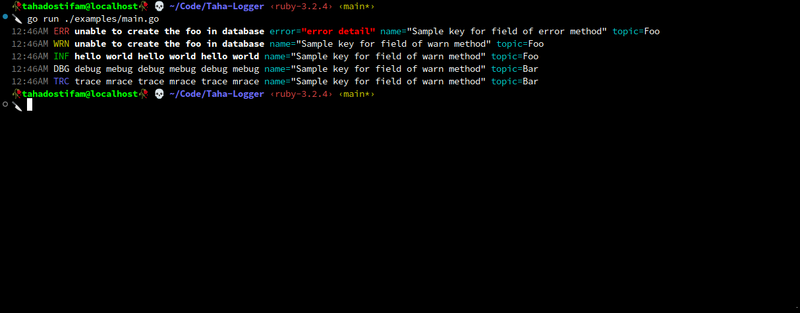

# 👾 Go Logger Library

A flexible, efficient, structured and topic based logging library designed based on [Zerolog](https://github.com/rs/zerolog) for Go.

## Installation

```bash
go get -u github.com/tahadostifam/logger@latest
```

## Screenshot



## Usage

Checkout `examples` directory for more information.
